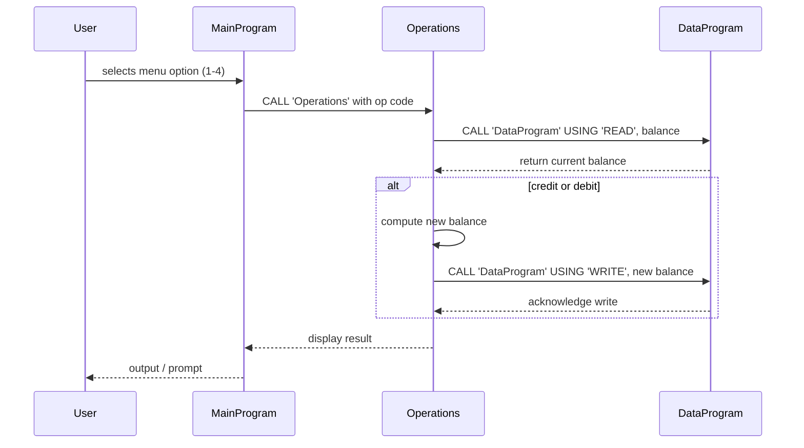

# COBOL Source Overview

This directory documents the purpose and behavior of each COBOL program in the repository. The system models a simple **student account management** workflow, with balance tracking and basic transactions.

## Files

### `data.cob`

- **Purpose**: Maintains a single stored account balance in working storage. Acts as a lightweight data module that other programs call to read or write the balance.
- **Key Functions**:
  - `READ` operation: copies the internal `STORAGE-BALANCE` to the calling program's `BALANCE` field.
  - `WRITE` operation: updates the internal `STORAGE-BALANCE` from the passed-in `BALANCE` value.
- **Business Rules**:
  - Only one account balance is stored; concurrency is not handled.
  - No validation occurs here; it simply moves values between modules.

### `operations.cob`

- **Purpose**: Implements the logic for viewing the current balance and performing credit/debit operations. It bridges user interaction and the data module.
- **Key Functions**:
  - Evaluates the operation type passed by the caller (`TOTAL`, `CREDIT`, `DEBIT`).
  - For `TOTAL`: reads the balance from `data.cob` and displays it.
  - For `CREDIT`: prompts user for an amount, reads balance, adds amount, updates balance via `WRITE`, and displays the new balance.
  - For `DEBIT`: prompts for an amount, reads balance, checks sufficient funds, subtracts if allowed, writes updated balance, and displays a confirmation or an "Insufficient funds" message.
- **Business Rules**:
  - Debit operations cannot proceed if the withdrawal amount exceeds the current balance.
  - Balances are handled in a fixed-point format (PIC 9(6)V99).
  - The initial `FINAL-BALANCE` value is set to 1000.00, representing a starting account balance.

### `main.cob`

- **Purpose**: Provides a simple text-based menu interface that allows a user to interact with the account system.
- **Key Functions**:
  - Displays menu options for viewing balance, crediting, debiting, or exiting.
  - Accepts user input and calls `operations.cob` with the corresponding operation code.
  - Loops until the user chooses to exit (`4`).
- **Business Rules**:
  - Only numeric choices 1–4 are accepted; invalid choices produce an error message.
  - User-entered choices drive the flow; no additional validation of amounts occurs here.

## General Notes

- These programs assume a single, in-memory account and are primarily educational.
- There is no persistence beyond the life of the program run, and all modules communicate via `CALL`/`LINKAGE` sections.
- The COBOL code is structured modularly to separate data storage (`data.cob`), operations logic (`operations.cob`), and user interface (`main.cob`).

---

Feel free to update this documentation as the code evolves or additional business rules are introduced.

## Sequence Diagram

